# CaseStudy10_LeeMessaGarza
Brian Less, Araya Messa, Tony Garza  
July 24, 2016  
# Import and Prepare Data


```r
knitr::opts_chunk$set(echo = TRUE)
```


```r
library(fpp)
```

```
## Loading required package: forecast
```

```
## Loading required package: zoo
```

```
## 
## Attaching package: 'zoo'
```

```
## The following objects are masked from 'package:base':
## 
##     as.Date, as.Date.numeric
```

```
## Loading required package: timeDate
```

```
## This is forecast 7.1
```

```
## Loading required package: fma
```

```
## Loading required package: tseries
```

```
## Loading required package: expsmooth
```

```
## Loading required package: lmtest
```

```r
#################################################################################
#   1.1 Import the exports data and the indicators                              #
#################################################################################

### !!! In order to test the script, it is necessary to change the three
### file paths. The files have been sent together with the script!!!

# The Export data for Chulwalar   are in two .csv files.
# One file for the as is data: ImportedAsIsDataChulwalar.csv
# and another one for the plan data: ImportedPlanDataChulwalar.csv

setwd("~/Dropbox/SMUDataScienceClass/1st class/Week 10/CaseStudy10_LeeMessaGarza")

ImportedAsIsData <- read.csv("ImportedAsIsDataChulwalar.csv", header = F, sep=";", fill = T) #chose ImportedAsIsDataChulwalar.csv

ImportedPlanData <- read.csv("ImportedPlanDataChulwalar.csv", header = F, sep=";", fill = T) #chose ImportedPlanDataChulwalar.csv


# The indicators data is also in a file: ImportedIndicatorsChulwalar.csv
ImportedIndicators <- read.csv("ImportedIndicatorsChulwalar.csv", header = F, sep=";", fill = T) # chose ImportedIndicatorsChulwalar.csv


TotalAsIsVector <- c(ImportedAsIsData [2:13,2],ImportedAsIsData [2:13,3],ImportedAsIsData [2:13,4],ImportedAsIsData [2:13,5],ImportedAsIsData [2:13,6],ImportedAsIsData [2:13,7])
EfakAsIsVector <- c(ImportedAsIsData [16:27,2],ImportedAsIsData [16:27,3],ImportedAsIsData [16:27,4],ImportedAsIsData [16:27,5],ImportedAsIsData [16:27,6],ImportedAsIsData [16:27,7])
WugeAsIsVector <- c(ImportedAsIsData [30:41,2],ImportedAsIsData [30:41,3],ImportedAsIsData [30:41,4],ImportedAsIsData [30:41,5],ImportedAsIsData [30:41,6],ImportedAsIsData [30:41,7])
TotalEtelAsIsVector <- c(ImportedAsIsData [44:55,2],ImportedAsIsData [44:55,3],ImportedAsIsData [44:55,4],ImportedAsIsData [44:55,5],ImportedAsIsData [44:55,6],ImportedAsIsData [44:55,7])
BlueEtelAsIsVector <- c(ImportedAsIsData [58:69,2],ImportedAsIsData [58:69,3],ImportedAsIsData [58:69,4],ImportedAsIsData [58:69,5],ImportedAsIsData [58:69,6],ImportedAsIsData [58:69,7])
RedEtelAsIsVector <- c(ImportedAsIsData [72:83,2],ImportedAsIsData [72:83,3],ImportedAsIsData [72:83,4],ImportedAsIsData [72:83,5],ImportedAsIsData [72:83,6],ImportedAsIsData [72:83,7])
YearAsIsVector <- c(ImportedAsIsData [86,2],ImportedAsIsData [86,3],ImportedAsIsData [86,4],ImportedAsIsData [86,5],ImportedAsIsData [86,6],ImportedAsIsData [86,7])
TotalAsIsVector_2014 <- c(ImportedAsIsData[2:13,8])

PlanVector <- c(ImportedPlanData[2:13,2],ImportedPlanData[2:13,3],ImportedPlanData[2:13,4],ImportedPlanData[2:13,5],ImportedPlanData[2:13,6],ImportedPlanData[2:13,7])
EfakPlanVector <- c(ImportedPlanData[16:27,2],ImportedPlanData[16:27,3],ImportedPlanData[16:27,4],ImportedPlanData[16:27,5],ImportedPlanData[16:27,6],ImportedPlanData[16:27,7])
WugePlanVector <- c(ImportedPlanData[30:41,2],ImportedPlanData[30:41,3],ImportedPlanData[30:41,4],ImportedPlanData[30:41,5],ImportedPlanData[30:41,6],ImportedPlanData[30:41,7])
TotalEtelPlanVector <- c(ImportedPlanData[44:55,2],ImportedPlanData[44:55,3],ImportedPlanData[44:55,4],ImportedPlanData[44:55,5],ImportedPlanData[44:55,6],ImportedPlanData[44:55,7])
BlueEtelPlanVector <- c(ImportedPlanData[58:69,2],ImportedPlanData[58:69,3],ImportedPlanData[58:69,4],ImportedPlanData[58:69,5],ImportedPlanData[58:69,6],ImportedPlanData[58:69,7])
RedEtelPlanVector <- c(ImportedPlanData[72:83,2],ImportedPlanData[72:83,3],ImportedPlanData[72:83,4],ImportedPlanData[72:83,5],ImportedPlanData[72:83,6],ImportedPlanData[72:83,7])
YearPlanVector <- c(ImportedPlanData[86,2],ImportedPlanData[86,3],ImportedPlanData[86,4],ImportedPlanData[86,5],ImportedPlanData[86,6],ImportedPlanData[86,7])
PlanVector_2014 <- c(ImportedPlanData[2:13,8])

# The data is saved as a vector and needs to be converted into a time series

TotalAsIs<- ts(TotalAsIsVector , start=c(2008,1), end=c(2013,12), frequency=12)
EfakAsIs <- ts(EfakAsIsVector , start=c(2008,1), end=c(2013,12), frequency=12)
WugeAsIs <- ts(WugeAsIsVector, start=c(2008,1), end=c(2013,12), frequency=12)
TotalEtelAsIs<- ts(TotalEtelAsIsVector, start=c(2008,1), end=c(2013,12), frequency=12)
BlueEtelAsIs <- ts(BlueEtelAsIsVector, start=c(2008,1), end=c(2013,12), frequency=12)
RedEtelAsIs <- ts(RedEtelAsIsVector, start=c(2008,1), end=c(2013,12), frequency=12)
YearAsIs <- ts(YearAsIsVector, start=c(2008,1), end=c(2013,12), frequency=12)
TotalAsIs_2014 <- ts(TotalAsIsVector_2014, start=c(2014,1), end=c(2014,12), frequency=12)

TotalPlan <- ts(PlanVector , start=c(2008,1), end=c(2013,12), frequency=12)
EfakPlan <- ts(EfakPlanVector, start=c(2008,1), end=c(2013,12), frequency=12)
WugePlan <- ts(WugePlanVector, start=c(2008,1), end=c(2013,12), frequency=12)
TotalEtelPlan <- ts(TotalEtelPlanVector, start=c(2008,1), end=c(2013,12), frequency=12)
BlueEtelPlan <- ts(BlueEtelPlanVector, start=c(2008,1), end=c(2013,12), frequency=12)
RedEtelPlan <- ts(RedEtelPlanVector, start=c(2008,1), end=c(2013,12), frequency=12)
YearPlan <- ts(YearPlanVector, start=c(2008,1), end=c(2013,12), frequency=12)
TotalPlan_2014 <- ts(PlanVector_2014, start=c(2014,1), end=c(2014,12), frequency=12)

# Call up the time series to check everything has worked.

TotalAsIs
```

```
##          Jan     Feb     Mar     Apr     May     Jun     Jul     Aug
## 2008 2313221 1950131 2346635 2039787 1756964 1458302 1679637 1639670
## 2009 2610573 2371327 2743786 2125308 1850073 1836222 1797311 1851968
## 2010 2760688 2918333 3227041 1613888 2550157 2317645 1474144 2148521
## 2011 3112861 2926663 3294784 2577079 2774068 2378227 2222900 2991787
## 2012 3093088 3679308 3433364 2714899 3011767 2726028 2483834 3055655
## 2013 4119526 3535744 3560974 3760065 2959933 2787898 2828744 3084113
##          Sep     Oct     Nov     Dec
## 2008 2882886 2959716 2596494 2656568
## 2009 3271171 2818888 3310776 3022513
## 2010 3898571 3348953 3135945 3332886
## 2011 4151531 3318684 4037076 3429843
## 2012 4200796 4228724 4618540 3383673
## 2013 5107775 4562144 4729313 4372181
```

```r
EfakAsIs
```

```
##          Jan     Feb     Mar     Apr     May     Jun     Jul     Aug
## 2008  416589  472565  466539  370774  457741  384817  464502  389013
## 2009  430055  468187  648582  414990  466329  465775  430988  502499
## 2010  508177  601115  775996  323532  672011  589895  438340  483363
## 2011  778643  726254  943274  845136 1030397  829198  741981  820385
## 2012  849409 1021474 1034025  904449  986452 1011487  862239 1026357
## 2013 1065097  952195 1062892 1057988 1127932  933365 1069867 1020078
##          Sep     Oct     Nov     Dec
## 2008  508370  495598  529191  441545
## 2009  584983  506877  593705  641582
## 2010  630064  608942  688055  693058
## 2011  851428  873895  996616  941611
## 2012  898892 1079994 1259730  986962
## 2013 1049970 1197452 1283970 1280835
```

```r
WugeAsIs
```

```
##         Jan    Feb    Mar    Apr    May    Jun    Jul    Aug    Sep    Oct
## 2008 414571 344579 429907 379606 305697 314582 346800 323618 578252 510031
## 2009 462768 393940 458486 401535 367847 373210 351526 358676 589599 501149
## 2010 525307 515202 581672 340651 565867 450257 378953 459746 792018 616164
## 2011 507281 564342 684259 487103 601078 507467 504952 655479 864312 636096
## 2012 545966 632103 619301 602511 609931 574084 510154 663220 827807 824506
## 2013 752685 708242 719168 787368 574721 643629 628135 718542 923583 934234
##         Nov    Dec
## 2008 431480 489935
## 2009 586040 659757
## 2010 620973 750844
## 2011 787231 712204
## 2012 855732 691108
## 2013 886772 948935
```

```r
TotalEtelAsIs
```

```
##          Jan     Feb     Mar     Apr     May     Jun     Jul     Aug
## 2008 1279668 1053325 1367520 1090725  873568  644479  772658  806741
## 2009 1583216 1407388 1420801 1141100  919860  858876  910134  843050
## 2010 1637464 1676161 1549560  813469 1198401 1140024  551268 1012542
## 2011 1595267 1473528 1469728 1034650  952553  819303  802076 1222812
## 2012 1519748 1812897 1607280 1008022 1291983  940158  945929 1235146
## 2013 2109497 1738197 1633944 1745092 1039449 1054201 1003166 1154675
##          Sep     Oct     Nov     Dec
## 2008 1715265 1795751 1518288 1601324
## 2009 1981563 1647934 1857836 1615091
## 2010 2335488 1856264 1678123 1699063
## 2011 2303271 1591584 1960675 1713991
## 2012 2330334 2177895 2306324 1618147
## 2013 3000929 2305605 2284672 2062160
```

```r
BlueEtelAsIs 
```

```
##         Jan    Feb    Mar    Apr    May    Jun    Jul    Aug    Sep    Oct
## 2008 425892 316631 353512 278711 212940 187849 206285 195810 448733 403327
## 2009 407424 287654 305158 255687 200068 210118 211668 198472 361703 366410
## 2010 369783 345144 322695 223841 239441 240316 138604 231179 329090 368584
## 2011 308893 282106 347124 261498 217606 208258 174878 247714 312012 331926
## 2012 285207 450874 360034 252674 247734 221676 216918 254993 299658 457595
## 2013 387497 349013 334274 325052 255416 237019 239047 358552 359703 427681
##         Nov    Dec
## 2008 306171 345955
## 2009 350196 351651
## 2010 320947 373302
## 2011 389858 299115
## 2012 388917 303450
## 2013 434561 348558
```

```r
RedEtelAsIs 
```

```
##          Jan     Feb     Mar     Apr     May     Jun     Jul     Aug
## 2008  853776  736694 1014008  812014  660628  456630  566373  610931
## 2009 1175792 1119734 1115643  885413  719792  648758  698466  644578
## 2010 1267682 1331017 1226866  589628  958960  899709  412664  781363
## 2011 1286374 1191422 1122604  773151  734947  611045  627198  975098
## 2012 1234541 1362023 1247246  755347 1044249  718482  729011  980154
## 2013 1722000 1389184 1299670 1420039  784033  817182  764120  796123
##          Sep     Oct     Nov     Dec
## 2008 1266532 1392424 1212117 1255369
## 2009 1619860 1281524 1507640 1263440
## 2010 2006398 1487680 1357176 1325761
## 2011 1991259 1259658 1570817 1414876
## 2012 2030676 1720301 1917408 1314697
## 2013 2641226 1877924 1850111 1713603
```

```r
YearAsIs
```

```
##           Jan      Feb      Mar      Apr      May      Jun      Jul
## 2008 26280011 29609916 32726772 37215503 40629676 45408410 26280011
## 2009 26280011 29609916 32726772 37215503 40629676 45408410 26280011
## 2010 26280011 29609916 32726772 37215503 40629676 45408410 26280011
## 2011 26280011 29609916 32726772 37215503 40629676 45408410 26280011
## 2012 26280011 29609916 32726772 37215503 40629676 45408410 26280011
## 2013 26280011 29609916 32726772 37215503 40629676 45408410 26280011
##           Aug      Sep      Oct      Nov      Dec
## 2008 29609916 32726772 37215503 40629676 45408410
## 2009 29609916 32726772 37215503 40629676 45408410
## 2010 29609916 32726772 37215503 40629676 45408410
## 2011 29609916 32726772 37215503 40629676 45408410
## 2012 29609916 32726772 37215503 40629676 45408410
## 2013 29609916 32726772 37215503 40629676 45408410
```

```r
TotalAsIs_2014
```

```
##          Jan     Feb     Mar     Apr     May     Jun     Jul     Aug
## 2014 4308161 4155378 3924332 3659121 3898758 3313891 3595106 3502426
##          Sep     Oct     Nov     Dec
## 2014 5619059 5274287 4841693 4664854
```

```r
TotalPlan
```

```
##          Jan     Feb     Mar     Apr     May     Jun     Jul     Aug
## 2008 2243103 2162705 2720911 2011182 1877757 1819924 1682196 1893171
## 2009 2547980 2247049 2731156 2020158 2098038 1927995 1783692 1907705
## 2010 2965885 2751170 2906493 2383358 2246893 1992851 2023434 2244997
## 2011 3113110 2883766 2957893 2601648 2370949 2339881 2105328 2341623
## 2012 3895396 3588151 3787240 3036434 2907891 2707822 2619486 3784557
## 2013 3580325 3863212 3606083 3213575 3139128 2998610 2785453 3083654
##          Sep     Oct     Nov     Dec
## 2008 3325711 2662148 2909966 2574633
## 2009 3124040 3102251 3154669 2742367
## 2010 3257717 3536338 3358206 3112906
## 2011 4086297 3640827 3502334 3280476
## 2012 4987460 4367319 4205772 4059533
## 2013 5143757 4149334 4495212 4093664
```

```r
EfakPlan
```

```
##          Jan     Feb     Mar     Apr     May     Jun     Jul     Aug
## 2008  492421  444995  665274  444369  487668  445242  443318  501222
## 2009  450498  380959  592616  400839  471523  405564  401100  444250
## 2010  506991  550412  629309  468600  535435  475326  482147  466887
## 2011  646987  652598  778405  717677  684701  639433  659271  652132
## 2012 1057786 1006335 1260206 1006509  979754  985549  964181 1027988
## 2013  940156 1094548 1053751 1072364 1061436 1077276  984463 1010619
##          Sep     Oct     Nov     Dec
## 2008  546249  553286  664734  560104
## 2009  488899  584729  659061  512219
## 2010  532164  543650  662090  527275
## 2011  736826  774047  791780  823396
## 2012 1090561 1151231 1222188 1148541
## 2013 1083541 1089769 1151019 1044125
```

```r
WugePlan 
```

```
##          Jan     Feb     Mar     Apr     May     Jun     Jul     Aug
## 2008  424190  388688  457796  363828  364246  358439  321255  370153
## 2009  443454  381571  471631  393075  379443  360120  337682  381164
## 2010  685504  559040  590397  566135  448967  442838  423206  458609
## 2011  593024  570173  552269  522050  458092  475669  451094  602954
## 2012  665434  657383  706987  601083  604292  571937  575704  802634
## 2013  670157  673123  727908  680251  687880  702883  623366  694089
##          Sep     Oct     Nov     Dec
## 2008  645618  470648  529375  448355
## 2009  597557  511889  573453  478396
## 2010  651525  598009  575012  544435
## 2011  751102  736236  681492  693967
## 2012  911343  830770  814818  870857
## 2013 1029222  853935  889003  842765
```

```r
TotalEtelPlan
```

```
##          Jan     Feb     Mar     Apr     May     Jun     Jul     Aug
## 2008 1263613 1231125 1489621 1051346  933392  932047  855520  923070
## 2009 1546801 1378217 1563799 1166229 1057223  983279  913751  980703
## 2010 1648769 1490577 1538493 1208636 1104777  931127  916160 1096933
## 2011 1781991 1564272 1455531 1257528 1134418 1018200  843336  974375
## 2012 2070256 1731099 1663266 1232994 1164076 1018137  932241 1800576
## 2013 1864733 1837228 1663834 1305603 1172373 1089115 1074687 1217930
##          Sep     Oct     Nov     Dec
## 2008 2080877 1575579 1561956 1515127
## 2009 1974166 1886971 1839155 1727567
## 2010 1832882 2103588 1877929 1862684
## 2011 2435674 1972649 1873075 1684766
## 2012 2823873 2224655 2025003 1955509
## 2013 2916115 2043888 2199880 2133214
```

```r
BlueEtelPlan
```

```
##         Jan    Feb    Mar    Apr    May    Jun    Jul    Aug    Sep    Oct
## 2008 449227 373663 415732 331337 290942 287603 245390 284540 554127 467772
## 2009 394188 320490 351375 271021 225914 234600 191342 226507 519935 512283
## 2010 388677 317587 306376 275940 235850 224371 204869 220570 357203 413862
## 2011 412463 323577 313230 276210 249768 217911 209229 219002 365415 421679
## 2012 481147 412798 364106 311291 283279 286839 249233 288342 399167 524838
## 2013 360982 342370 346868 277548 251623 257153 232752 252611 494843 445720
##         Nov    Dec
## 2008 469089 409962
## 2009 456203 376595
## 2010 357645 364243
## 2011 359800 343171
## 2012 399038 415564
## 2013 414612 401854
```

```r
RedEtelPlan
```

```
##          Jan     Feb     Mar     Apr     May     Jun     Jul     Aug
## 2008  814386  857462 1073889  720009  642450  644444  610130  638530
## 2009 1152613 1057727 1212424  895208  831309  748679  722409  754196
## 2010 1260092 1172990 1232117  932696  868927  706756  711291  876363
## 2011 1369528 1240695 1142301  981318  884650  800289  634107  755372
## 2012 1589109 1318301 1299159  921703  880796  731299  683008 1512234
## 2013 1503751 1494858 1316966 1028055  920750  831961  841936  965319
##          Sep     Oct     Nov     Dec
## 2008 1526750 1107807 1092867 1105165
## 2009 1454231 1374688 1382952 1350972
## 2010 1475679 1689726 1520284 1498441
## 2011 2070259 1550970 1513274 1341595
## 2012 2424705 1699817 1625965 1539945
## 2013 2421272 1598167 1785268 1731360
```

```r
YearPlan
```

```
##           Jan      Feb      Mar      Apr      May      Jun      Jul
## 2008 27883407 29387100 32780247 35224132 43947063 44152007 27883407
## 2009 27883407 29387100 32780247 35224132 43947063 44152007 27883407
## 2010 27883407 29387100 32780247 35224132 43947063 44152007 27883407
## 2011 27883407 29387100 32780247 35224132 43947063 44152007 27883407
## 2012 27883407 29387100 32780247 35224132 43947063 44152007 27883407
## 2013 27883407 29387100 32780247 35224132 43947063 44152007 27883407
##           Aug      Sep      Oct      Nov      Dec
## 2008 29387100 32780247 35224132 43947063 44152007
## 2009 29387100 32780247 35224132 43947063 44152007
## 2010 29387100 32780247 35224132 43947063 44152007
## 2011 29387100 32780247 35224132 43947063 44152007
## 2012 29387100 32780247 35224132 43947063 44152007
## 2013 29387100 32780247 35224132 43947063 44152007
```

```r
TotalPlan_2014
```

```
##          Jan     Feb     Mar     Apr     May     Jun     Jul     Aug
## 2014 4474000 4185565 4278119 3985542 3605973 3515173 3269444 3656112
##          Sep     Oct     Nov     Dec
## 2014 5637391 5157781 5353458 4703185
```

##Plot Them

```r
par(mfrow=c(3,2))

plot(TotalAsIs, col="black", main="TotalAsIs")
plot(EfakAsIs , col="red",main="EfakAsIs")
plot(WugeAsIs, col="blue", main="WugeAsIs")
plot(TotalEtelAsIs, col="green",main="TotalEtelAsIs")
plot(BlueEtelAsIs, col="orange", main="BlueEtelAsIs")
plot(RedEtelAsIs, col="purple", main="RedEtelAsIs")
```

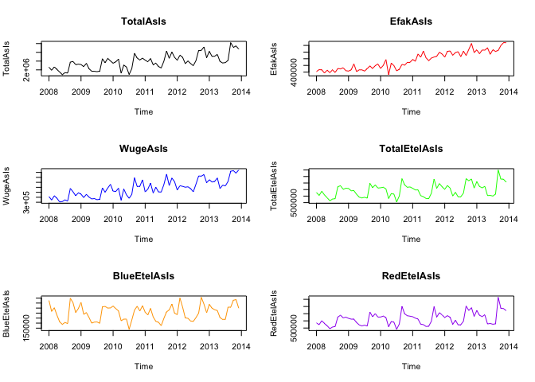<!-- -->

```r
plot(TotalPlan , col="black", main="TotalPlan")
plot(EfakPlan , col="red",main="EfakPlan")
plot(WugePlan, col="blue", main="WugePlan")
plot(TotalEtelPlan, col="green",main="TotalEtelPlan")
plot(BlueEtelPlan, col="orange", main="BlueEtelPlan")
plot(RedEtelPlan, col="purple", main="RedEtelPlan")
```

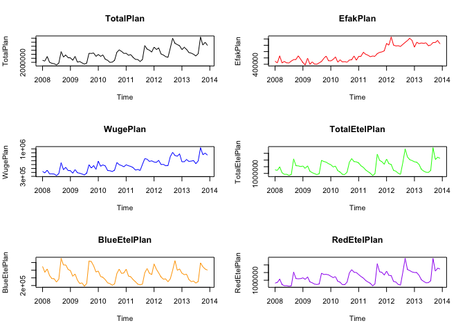<!-- -->

# Brian Portion: Test Correlation/Model

```r
cor(TotalAsIs, TotalPlan )
```

```
## [1] 0.9183402
```

```r
cor(EfakAsIs , EfakPlan)
```

```
## [1] 0.9055081
```

```r
cor(WugeAsIs, WugePlan)
```

```
## [1] 0.8788474
```

```r
cor(TotalEtelAsIs, TotalEtelPlan)
```

```
## [1] 0.9159505
```

```r
cor(BlueEtelAsIs , BlueEtelPlan)
```

```
## [1] 0.8044146
```

```r
cor(RedEtelAsIs , RedEtelPlan)
```

```
## [1] 0.9106702
```

```r
cor(YearAsIs, YearPlan)
```

```
## [1] 0.9627401
```

```r
TotalAsIs_lm <- lm(TotalAsIs ~ TotalPlan , data = TotalAsIs)
summary(TotalAsIs_lm)
```

```
## 
## Call:
## lm(formula = TotalAsIs ~ TotalPlan, data = TotalAsIs)
## 
## Residuals:
##     Min      1Q  Median      3Q     Max 
## -770214 -196776   26017  182579  672705 
## 
## Coefficients:
##              Estimate Std. Error t value Pr(>|t|)    
## (Intercept) 8.959e+04  1.521e+05   0.589    0.558    
## TotalPlan   9.627e-01  4.959e-02  19.413   <2e-16 ***
## ---
## Signif. codes:  0 '***' 0.001 '**' 0.01 '*' 0.05 '.' 0.1 ' ' 1
## 
## Residual standard error: 332600 on 70 degrees of freedom
## Multiple R-squared:  0.8433,	Adjusted R-squared:  0.8411 
## F-statistic: 376.9 on 1 and 70 DF,  p-value: < 2.2e-16
```

```r
TotalAsIs_tslm <- tslm(TotalAsIs ~ TotalPlan )
summary(TotalAsIs_tslm)
```

```
## 
## Call:
## tslm(formula = TotalAsIs ~ TotalPlan)
## 
## Residuals:
##     Min      1Q  Median      3Q     Max 
## -770214 -196776   26017  182579  672705 
## 
## Coefficients:
##              Estimate Std. Error t value Pr(>|t|)    
## (Intercept) 8.959e+04  1.521e+05   0.589    0.558    
## TotalPlan   9.627e-01  4.959e-02  19.413   <2e-16 ***
## ---
## Signif. codes:  0 '***' 0.001 '**' 0.01 '*' 0.05 '.' 0.1 ' ' 1
## 
## Residual standard error: 332600 on 70 degrees of freedom
## Multiple R-squared:  0.8433,	Adjusted R-squared:  0.8411 
## F-statistic: 376.9 on 1 and 70 DF,  p-value: < 2.2e-16
```

```r
# National Holidays
NationalHolidaysVector <- c(ImportedIndicators[170:181,2],ImportedIndicators[170:181,3],ImportedIndicators[170:181,4],ImportedIndicators[170:181,5],ImportedIndicators[170:181,6],ImportedIndicators[170:181,7])
NationalHolidays <- ts(NationalHolidaysVector, start=c(2008,1), end=c(2013,12), frequency=12)
plot(NationalHolidays, main="NationalHolidays")
```

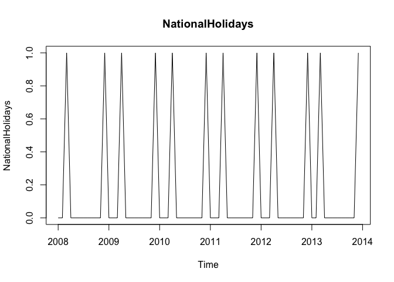<!-- -->

```r
cor(TotalAsIs, NationalHolidays)
```

```
## [1] -0.007883708
```

```r
cor(EfakAsIs , NationalHolidays)
```

```
## [1] 0.001235706
```

```r
cor(WugeAsIs, NationalHolidays)
```

```
## [1] 0.06505569
```

```r
cor(TotalEtelAsIs, NationalHolidays)
```

```
## [1] -0.01081446
```

```r
cor(BlueEtelAsIs , NationalHolidays)
```

```
## [1] 0.02903763
```

```r
cor(RedEtelAsIs , NationalHolidays)
```

```
## [1] -0.01717636
```

```r
# The months April and December do not correlate well with the exports data. 
# However later tests will show that these are worth considering. 
# The missing correlation is just due to the sparse structure of the NationalHolidays time series.
```

# Tony's Portion: Forecasting Models

```r
#################################################################################
#  7.1 Exponential Smoothing                                                    #
#################################################################################

# Exponential Smoothing uses past values to calculate a forecast. The strength 
# with which each value influences the forecast is weakened with help of a 
# smoothing parameter. Thus we are dealing with a weighted average, whose 
# values fade out the longer ago they were in the past.

#################################################################################
#  7.1.1 Simple expontential smoothing                                          #
#################################################################################

# Formula: ses(). It must be decided if alpha (the smoothing parameter
# should be automatically calculated. If initial=simple, the alpha value can 
# be set to any chosen value, if initial=optimal (or nothing, as this is the 
# default), alpha will be set to the optimal value based on ets().
# h=12 gives the number of cycles for the forecast.

Model_ses <- ses(TotalAsIs, h=12)
summary(Model_ses)
```

```
## 
## Forecast method: Simple exponential smoothing
## 
## Model Information:
## Simple exponential smoothing 
## 
## Call:
##  ses(x = TotalAsIs, h = 12) 
## 
##   Smoothing parameters:
##     alpha = 0.671 
## 
##   Initial states:
##     l = 2173226.7433 
## 
##   sigma:  609507
## 
##      AIC     AICc      BIC 
## 2230.058 2230.232 2234.612 
## 
## Error measures:
##                    ME   RMSE      MAE       MPE     MAPE     MASE
## Training set 47469.84 609507 429997.1 -1.511008 15.02336 1.172074
##                    ACF1
## Training set 0.02384493
## 
## Forecasts:
##          Point Forecast   Lo 80   Hi 80   Lo 95   Hi 95
## Jan 2014        4466448 3685333 5247562 3271836 5661059
## Feb 2014        4466448 3525801 5407094 3027853 5905042
## Mar 2014        4466448 3389650 5543245 2819628 6113267
## Apr 2014        4466448 3268880 5664015 2634926 6297969
## May 2014        4466448 3159220 5773675 2467215 6465680
## Jun 2014        4466448 3058072 5874823 2312524 6620371
## Jul 2014        4466448 2963718 5969177 2168221 6764674
## Aug 2014        4466448 2874947 6057948 2032458 6900437
## Sep 2014        4466448 2790873 6142022 1903878 7029017
## Oct 2014        4466448 2710821 6222074 1781448 7151447
## Nov 2014        4466448 2634263 6298632 1664363 7268532
## Dec 2014        4466448 2560778 6372117 1551977 7380918
```

```r
plot(Model_ses)
```

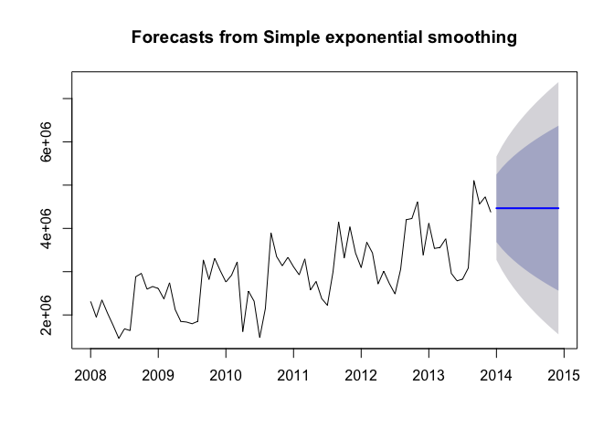<!-- -->

```r
# The Akaike's Information Criterion(AIC/AICc) or the Bayesian Information 
# Criterion (BIC) should be at minimum.

plot(Model_ses, plot.conf=FALSE, ylab="Exports Chulwalar  )", xlab="Year", main="", fcol="white", type="o")
lines(fitted(Model_ses), col="green", type="o")
lines(Model_ses$mean, col="blue", type="o")
legend("topleft",lty=1, col=c(1,"green"), c("data", expression(alpha == 0.671)),pch=1)
```

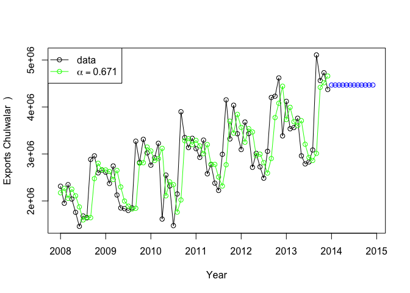<!-- -->

```r
#################################################################################
#  7.1.2 Holt's linear trend method                                             #
#################################################################################

# Holt added to the model in order to forecast using trends as well.
# For this it is necessary to add a beta, which determines the trend.
# If neither alpha nor beta is stated, both parameters will be optimised
# using ets(). 

Model_holt_1 <- holt(TotalAsIs,h=12)
summary(Model_holt_1)
```

```
## 
## Forecast method: Holt's method
## 
## Model Information:
## Holt's method 
## 
## Call:
##  holt(x = TotalAsIs, h = 12) 
## 
##   Smoothing parameters:
##     alpha = 0.6571 
##     beta  = 1e-04 
## 
##   Initial states:
##     l = 2040390.7764 
##     b = 45050.7514 
## 
##   sigma:  608119.1
## 
##      AIC     AICc      BIC 
## 2233.730 2234.327 2242.837 
## 
## Error measures:
##                    ME     RMSE      MAE      MPE     MAPE     MASE
## Training set -16586.9 608119.1 441110.7 -3.88925 15.75307 1.202367
##                    ACF1
## Training set 0.03462672
## 
## Forecasts:
##          Point Forecast   Lo 80   Hi 80   Lo 95   Hi 95
## Jan 2014        4536367 3757031 5315703 3344475 5728259
## Feb 2014        4581298 3648703 5513894 3155016 6007580
## Mar 2014        4626230 3562188 5690271 2998918 6253541
## Apr 2014        4671161 3490181 5852141 2865008 6477314
## May 2014        4716092 3428721 6003463 2747228 6684956
## Jun 2014        4761024 3375378 6146669 2641862 6880185
## Jul 2014        4805955 3328531 6283379 2546429 7065480
## Aug 2014        4850886 3287035 6414738 2459182 7242591
## Sep 2014        4895818 3250047 6541588 2378829 7412807
## Oct 2014        4940749 3216925 6664573 2304387 7577111
## Nov 2014        4985680 3187164 6784196 2235088 7736273
## Dec 2014        5030612 3160363 6900860 2170314 7890909
```

```r
plot(Model_holt_1)
```

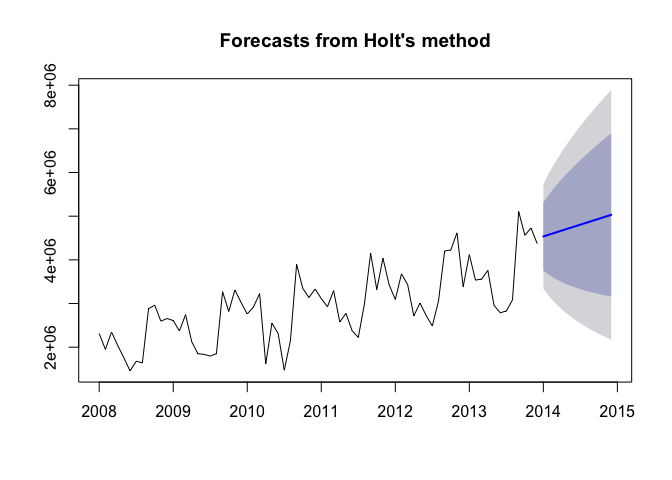<!-- -->

```r
# The trend is exponential if the intercepts(level) and the gradient (slope) are
# multiplied with eachother. The values are worse. As the Beta was very low in 
# the optimisation, the forecast is very similar to the ses() model. 


Model_holt_2<- holt(TotalAsIs, exponential=TRUE,h=12)
summary(Model_holt_2)
```

```
## 
## Forecast method: Holt's method with exponential trend
## 
## Model Information:
## Holt's method with exponential trend 
## 
## Call:
##  holt(x = TotalAsIs, h = 12, exponential = TRUE) 
## 
##   Smoothing parameters:
##     alpha = 0.6637 
##     beta  = 1e-04 
## 
##   Initial states:
##     l = 2041538.9468 
##     b = 1.0029 
## 
##   sigma:  0.2438
## 
##      AIC     AICc      BIC 
## 2251.010 2251.607 2260.116 
## 
## Error measures:
##                    ME     RMSE      MAE       MPE     MAPE     MASE
## Training set 37825.61 609787.5 433018.9 -1.838214 15.18487 1.180311
##                    ACF1
## Training set 0.02918287
## 
## Forecasts:
##          Point Forecast   Lo 80   Hi 80   Lo 95    Hi 95
## Jan 2014        4488281 3078953 5903878 2360914  6666728
## Feb 2014        4502175 2857159 6255784 2103002  7376765
## Mar 2014        4516113 2666800 6621537 1992608  8028208
## Apr 2014        4530094 2508890 6746109 1797024  8468408
## May 2014        4544118 2363573 7067527 1657379  9086520
## Jun 2014        4558186 2249317 7338701 1571014  9453619
## Jul 2014        4572297 2150172 7570727 1511828 10088050
## Aug 2014        4586452 2087297 7635230 1364043 10572461
## Sep 2014        4600650 1973969 7718172 1303990 10725249
## Oct 2014        4614893 1926158 7944558 1151619 11332954
## Nov 2014        4629180 1820298 8139566 1117728 11773254
## Dec 2014        4643510 1711868 8362422 1056542 12124675
```

```r
plot(Model_holt_2)
```

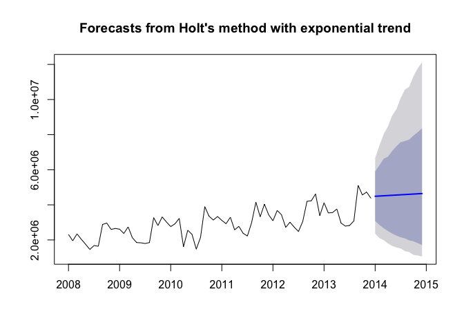<!-- -->

```r
# As such simple trends tend to forecast the future to positively, we have added
# a dampener.
# Similar values to that of Model_holt_1 

Model_holt_3 <- holt(TotalAsIs, damped=TRUE,h=12)
summary(Model_holt_3)
```

```
## 
## Forecast method: Damped Holt's method
## 
## Model Information:
## Damped Holt's method 
## 
## Call:
##  holt(x = TotalAsIs, h = 12, damped = TRUE) 
## 
##   Smoothing parameters:
##     alpha = 0.6613 
##     beta  = 2e-04 
##     phi   = 0.98 
## 
##   Initial states:
##     l = 2040392.5761 
##     b = 45053.25 
## 
##   sigma:  608787.2
## 
##      AIC     AICc      BIC 
## 2235.888 2236.797 2247.272 
## 
## Error measures:
##                    ME     RMSE      MAE       MPE     MAPE     MASE
## Training set 15578.94 608787.2 436909.7 -2.797612 15.46526 1.190916
##                    ACF1
## Training set 0.03351419
## 
## Forecasts:
##          Point Forecast   Lo 80   Hi 80   Lo 95   Hi 95
## Jan 2014        4483618 3703426 5263811 3290417 5676819
## Feb 2014        4493914 3558436 5429391 3063224 5924603
## Mar 2014        4504003 3435520 5572486 2869899 6138107
## Apr 2014        4513891 3327168 5700614 2698955 6328827
## May 2014        4523581 3229332 5817829 2544198 6502963
## Jun 2014        4533077 3139534 5926619 2401837 6664316
## Jul 2014        4542383 3056128 6028638 2269352 6815413
## Aug 2014        4551503 2977955 6125051 2144969 6958036
## Sep 2014        4560440 2904162 6216719 2027381 7093499
## Oct 2014        4569199 2834101 6304298 1915595 7222803
## Nov 2014        4577783 2767264 6388301 1808834 7346732
## Dec 2014        4586195 2703249 6469141 1706477 7465913
```

```r
plot(Model_holt_3)
```

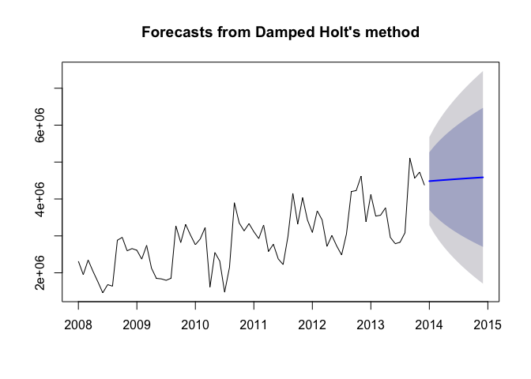<!-- -->

```r
# This also works for exponential trends. 
# The values remain worse. 

Model_holt_4 <- holt(TotalAsIs, exponential=TRUE, damped=TRUE,h=12)
summary(Model_holt_4)
```

```
## 
## Forecast method: Damped Holt's method with exponential trend
## 
## Model Information:
## Damped Holt's method with exponential trend 
## 
## Call:
##  holt(x = TotalAsIs, h = 12, damped = TRUE, exponential = TRUE) 
## 
##   Smoothing parameters:
##     alpha = 0.6679 
##     beta  = 1e-04 
##     phi   = 0.9799 
## 
##   Initial states:
##     l = 2041541.9705 
##     b = 1.0019 
## 
##   sigma:  0.2449
## 
##      AIC     AICc      BIC 
## 2253.216 2254.125 2264.600 
## 
## Error measures:
##                    ME     RMSE      MAE       MPE     MAPE     MASE
## Training set 46119.56 609906.7 432069.1 -1.549114 15.11987 1.177722
##                   ACF1
## Training set 0.0254941
## 
## Forecasts:
##          Point Forecast   Lo 80   Hi 80   Lo 95    Hi 95
## Jan 2014        4470648 3046370 5863656 2315019  6583786
## Feb 2014        4473164 2810068 6225729 2077065  7331284
## Mar 2014        4475630 2621273 6493092 1902867  7861495
## Apr 2014        4478047 2485109 6733241 1788287  8548118
## May 2014        4480418 2331909 6931000 1597972  8911375
## Jun 2014        4482742 2191189 7131407 1553523  9305830
## Jul 2014        4485020 2105509 7325547 1396762  9883704
## Aug 2014        4487253 1980088 7607393 1332814 10718159
## Sep 2014        4489443 1894478 7811224 1215251 10974477
## Oct 2014        4491589 1785735 8009747 1099334 11281676
## Nov 2014        4493694 1700893 8177025 1074395 11839100
## Dec 2014        4495757 1630362 8273122 1071639 12323486
```

```r
plot(Model_holt_4)
```

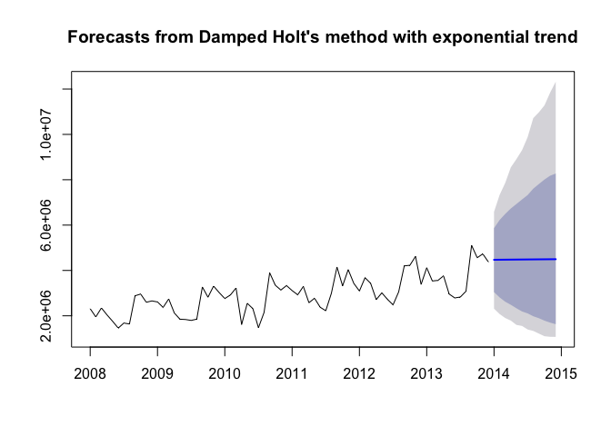<!-- -->

```r
# level and slope can be plotted individually for each model. 
plot(Model_holt_1$model$state)
```

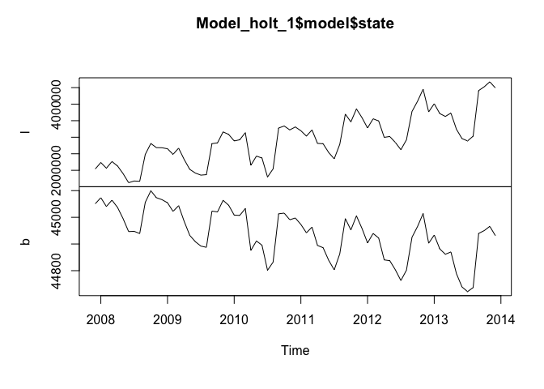<!-- -->

```r
plot(Model_holt_2$model$state)
```

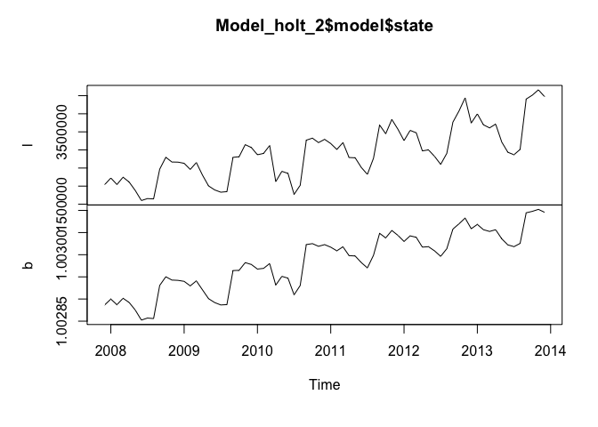<!-- -->

```r
plot(Model_holt_3$model$state)
```

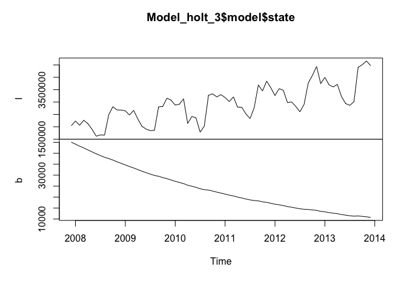<!-- -->

```r
plot(Model_holt_4$model$state)
```

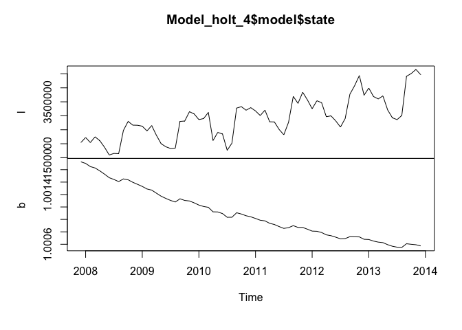<!-- -->

```r
plot(Model_holt_1, plot.conf=FALSE, ylab="Exports Chulwalar  )", xlab="Year", main="", fcol="white", type="o")
lines(fitted(Model_ses), col="purple", type="o")
lines(fitted(Model_holt_1), col="blue", type="o")
lines(fitted(Model_holt_2), col="red", type="o")
lines(fitted(Model_holt_3), col="green", type="o")
lines(fitted(Model_holt_4), col="orange", type="o")
lines(Model_ses$mean, col="purple", type="o")
lines(Model_holt_1$mean, col="blue", type="o")
lines(Model_holt_2$mean, col="red", type="o")
lines(Model_holt_3$mean, col="green", type="o")
lines(Model_holt_4$mean, col="orange", type="o")
legend("topleft",lty=1, col=c(1,"purple","blue","red","green","orange"), c("data", "SES","Holts auto", "Exponential", "Additive Damped", "Multiplicative Damped"),pch=1)
```

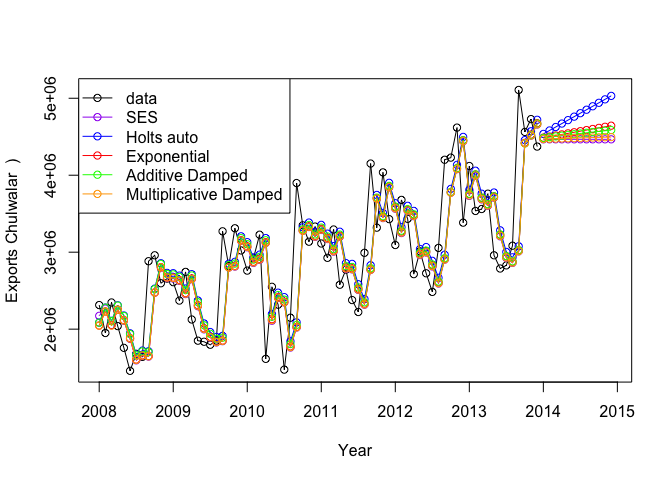<!-- -->

```r
# As these forecasts are not very convincing at the moment, there is no need 
# to export the data.
#################################################################################
#  7.1.3 Holt-Winter's seasonal method                                          #
#################################################################################

# Holt and Winters have expanded Holt's model further to include the
# seasonality aspect. The parameter gamma, which is for smoothing the
# seasonality, was added to achieve this. The values are better than 
# the models without seasonality. This logical matches our results from the regression approaches, 
# the data is strongly influenced by seasonality. 
# In the following model, none of the parameters are given so that they
# will be optimised automatically. There are two models: one using
# an additive error model method and one using a multiplicative error model.

Model_hw_1 <- hw(TotalAsIs ,seasonal="additive",h=12)
summary(Model_hw_1)
```

```
## 
## Forecast method: Holt-Winters' additive method
## 
## Model Information:
## Holt-Winters' additive method 
## 
## Call:
##  hw(x = TotalAsIs, h = 12, seasonal = "additive") 
## 
##   Smoothing parameters:
##     alpha = 0.0087 
##     beta  = 0.0087 
##     gamma = 1e-04 
## 
##   Initial states:
##     l = 2047375.0884 
##     b = 22509.7631 
##     s=259168.3 654942.6 474529.8 876025.2 -475155 -852844
##            -664662.5 -412596.7 -438677.3 273215 138077.9 167976.7
## 
##   sigma:  241685
## 
##      AIC     AICc      BIC 
## 2124.856 2134.747 2161.283 
## 
## Error measures:
##                    ME   RMSE      MAE         MPE     MAPE      MASE
## Training set 21615.43 241685 202218.5 -0.08252109 7.329458 0.5512016
##                    ACF1
## Training set -0.2819072
## 
## Forecasts:
##          Point Forecast   Lo 80   Hi 80   Lo 95   Hi 95
## Jan 2014        4141204 3831472 4450936 3667510 4614898
## Feb 2014        4147309 3837472 4457147 3673453 4621165
## Mar 2014        4318537 4008512 4628563 3844394 4792680
## Apr 2014        3642744 3332425 3953063 3168153 4117335
## May 2014        3704865 3394124 4015605 3229628 4180102
## Jun 2014        3488859 3177546 3800173 3012746 3964973
## Jul 2014        3336738 3024677 3648799 2859482 3813994
## Aug 2014        3750478 3437474 4063482 3271780 4229176
## Sep 2014        5137771 4823607 5451935 4657298 5618244
## Oct 2014        4772337 4456775 5087900 4289726 5254949
## Nov 2014        4988809 4671591 5306028 4503665 5473953
## Dec 2014        4629097 4309943 4948252 4140992 5117202
```

```r
plot(Model_hw_1)
```

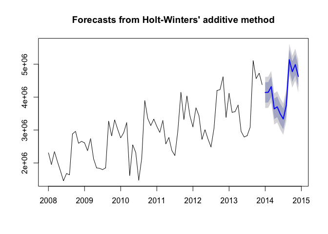<!-- -->

```r
#     AIC     AICc      BIC 
#2127.984 2137.875 2164.411 

Model_hw_2 <- hw(TotalAsIs ,seasonal="multiplicative",h=12)
summary(Model_hw_2)
```

```
## 
## Forecast method: Holt-Winters' multiplicative method
## 
## Model Information:
## Holt-Winters' multiplicative method 
## 
## Call:
##  hw(x = TotalAsIs, h = 12, seasonal = "multiplicative") 
## 
##   Smoothing parameters:
##     alpha = 0.025 
##     beta  = 0.0062 
##     gamma = 1e-04 
## 
##   Initial states:
##     l = 2026247.531 
##     b = 25395.1259 
##     s=1.0933 1.232 1.1763 1.3086 0.8384 0.699
##            0.7653 0.8502 0.8596 1.0793 1.0316 1.0665
## 
##   sigma:  0.0877
## 
##      AIC     AICc      BIC 
## 2128.303 2138.194 2164.729 
## 
## Error measures:
##                    ME     RMSE      MAE        MPE     MAPE      MASE
## Training set 17434.11 235296.6 191805.3 -0.3292809 7.213472 0.5228175
##                    ACF1
## Training set -0.3514421
## 
## Forecasts:
##          Point Forecast   Lo 80   Hi 80   Lo 95   Hi 95
## Jan 2014        4226941 3751624 4702258 3500006 4953876
## Feb 2014        4123665 3659738 4587591 3414151 4833179
## Mar 2014        4350808 3860995 4840620 3601704 5099911
## Apr 2014        3494208 3100476 3887940 2892046 4096370
## May 2014        3484738 3091618 3877858 2883513 4085963
## Jun 2014        3162774 2805463 3520085 2616314 3709234
## Jul 2014        2912399 2582802 3241996 2408324 3416474
## Aug 2014        3521645 3122278 3921013 2910865 4132425
## Sep 2014        5540988 4911109 6170867 4577671 6504304
## Oct 2014        5020487 4448200 5592775 4145249 5895725
## Nov 2014        5299729 4693715 5905743 4372911 6226547
## Dec 2014        4740169 4196230 5284108 3908286 5572052
```

```r
plot(Model_hw_2)
```

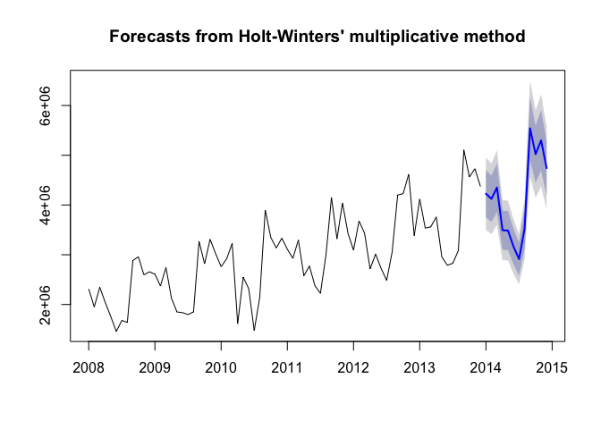<!-- -->

```r
#     AIC     AICc      BIC 
#2137.673 2147.564 2174.100 

# The additive model gives slightly better results than the multiplicative model.

plot(Model_hw_1, ylab="Exports Chulwalar  ", plot.conf=FALSE, type="o", fcol="white", xlab="Year")
lines(fitted(Model_hw_1), col="red", lty=2)
lines(fitted(Model_hw_2), col="green", lty=2)
lines(Model_hw_1$mean, type="o", col="red")
lines(Model_hw_2$mean, type="o", col="green")
legend("topleft",lty=1, pch=1, col=1:3, c("data","Holt Winters' Additive","Holt Winters' Multiplicative"))
```

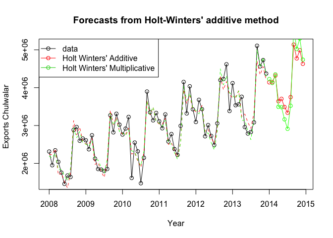<!-- -->

### SES AIC:       2230.058
### SES RMSE:    609507.0
### HOLT AIC:      2235.888
### HOLT RMSE:   608787.2
### HOLT_E AIC:    2253.216
### HOLT_E RMSE: 609906.7
### HW_A AIC:     2124.856 HW Additive Model said to be best choice
### HW_A RMSE:  241685.0
### HW_M AIC:     2128.303
### HW_M RMSE:  235296.6
### Provided case says the HW additive model gives slightly better results than the multiplicative model. However, one can make a case for the multiplicative model as AICs are similar and the RMSE for the multiplicative model is 3% less than the additive.

# Araya Portion: How well do they meet planned exports?
